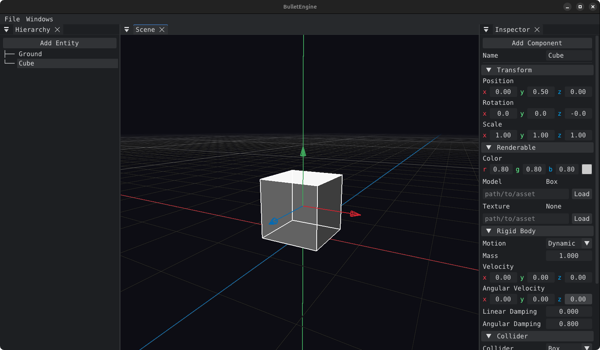

    

  <strong>Powered by</strong>

  

  
  

Minimal C/C++ 3D game engine. It brings a graphics engine module and a physics engine module together under a common entity model, editor and scene format.

    

